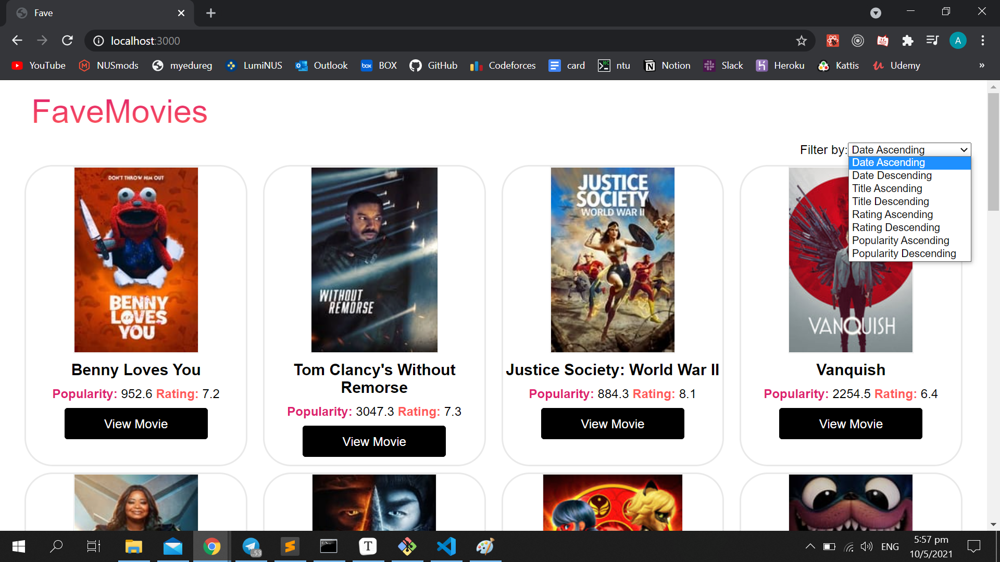
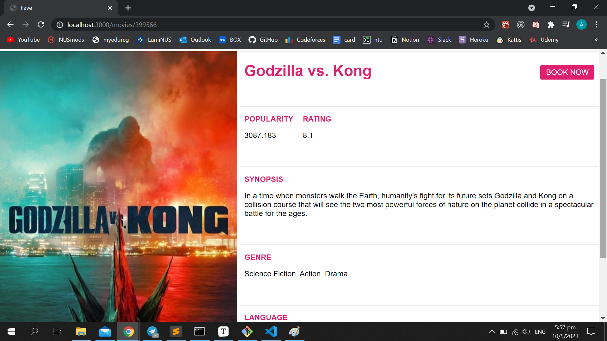
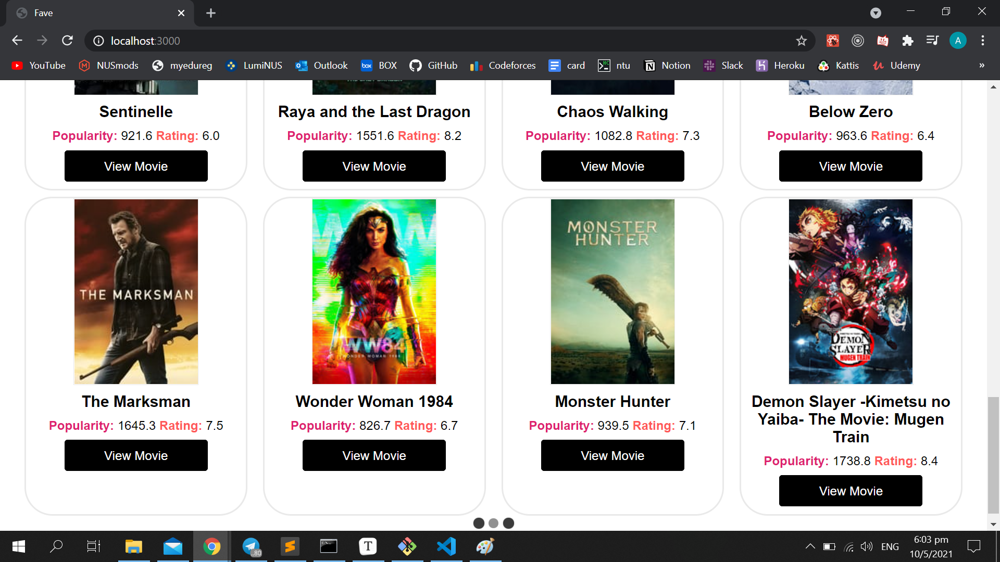
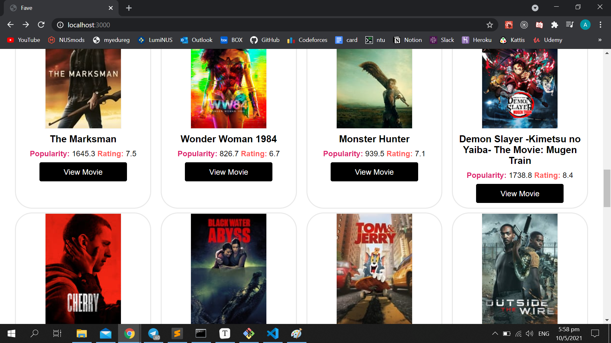
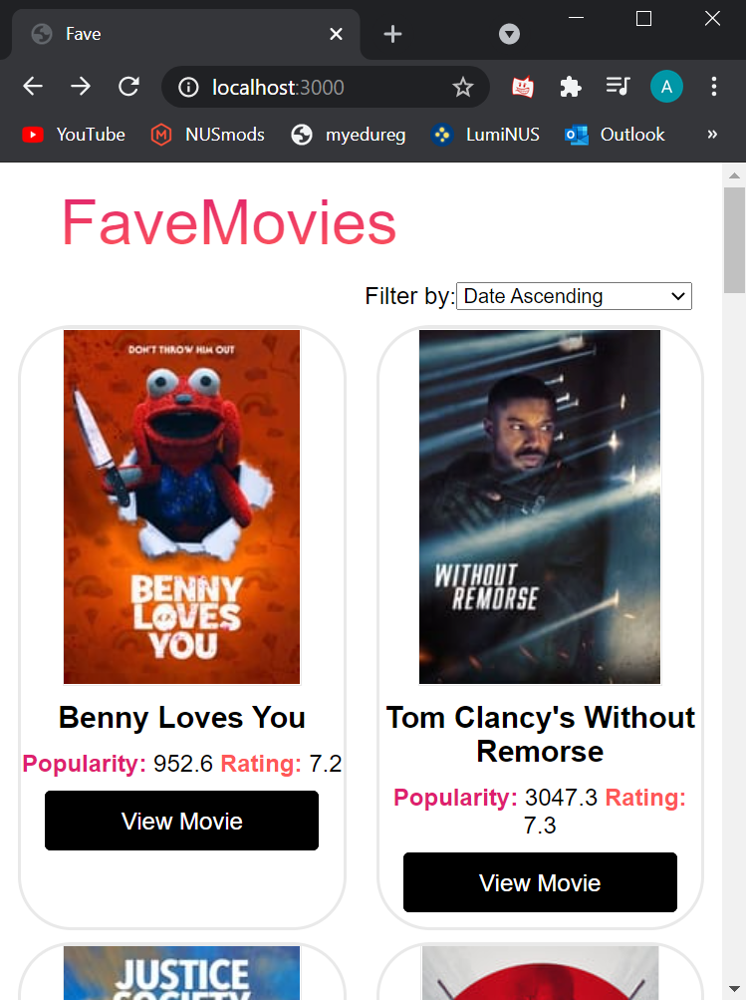

# **FaveMovies**

FaveMovies is a standalone movie website that pulls data from [TMDb](https://www.themoviedb.org/ ) and has the list of features:

- Movie details which include Poster image, Title and Popularity and a link that shows more details
- A dedicated detailed movie page which include: Synopsis, Genres, Language, Duration
- Mobile-friendly UI
- Ordered by release date (default), alphabetical and rating
- Loads more movies when scrolled to bottom

# **Website**

Coming soon!

# Screenshots

**Main page**

**Details page**

**Fetching movies when scrolled to bottom of page**

**Movies fetched**

**Mobile-friendly UI**